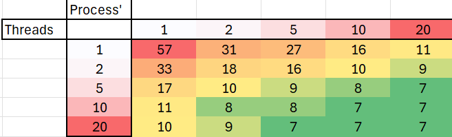

# System Programming Lab 11 Multiprocessing

## Original

### Implementation 
I made a seperate file called mandelmovie.c that takes in 3 arguments as
./mandelmovie -n 'numberOfChildren'. This program then calls the mandel.c
program with the number of processes based on an equation that alters the 
scale to just zoom into the mandelplot

### Graph of Time Results

### Summary
I found that there are diminishing returns to allowing more processes, 
it initially drops very fast in time but begins to level out. I also 
tried 50 processes just to see what would happen and it took the same amount
of time as 20 processes did.

## Added Threads

### Implementation
Adjusted mandel.c to handle an aditional thread count argument. Modified 
compute_image to call the correct amount of threads needed through my thread 
program compute_image_section. Created a structure to hold the image data 
so that I could pass the memory location to the helper thread method.

### Table of Time Results

### Summary
It looks like increasing the process amount seems to have helped a smidge more 
than increasing the thread count. This may be becuase creating a mandelbrot 
image is a lot of work that is better helped with more processing.

There wasnt neccessarily a sweet spot, rather, there was more of a cutoff of 7
seconds where additional processes or threads didnt further improve the time.