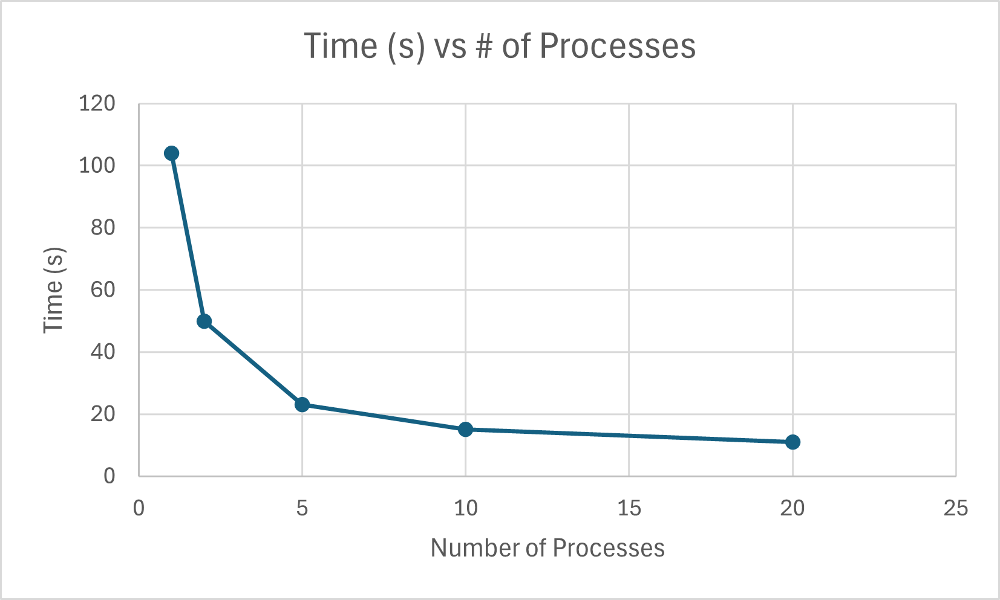

# System Programming Lab 11 Multiprocessing

## Implementation 
I made a seperate file called mandelmovie.c that takes in 3 arguments as
./mandelmovie -n 'numberOfChildren'. This program then calls the mandel.c
program with the number of processes based on an equation that alters the 
scale to just zoom into the mandelplot

## Graph of Time Results

## Summary
I found that there are diminishing returns to allowing more processes, 
it initially drops very fast in time but begins to level out. I also 
tried 50 processes just to see what would happen and it took the same amount
of time as 20 processes did.
